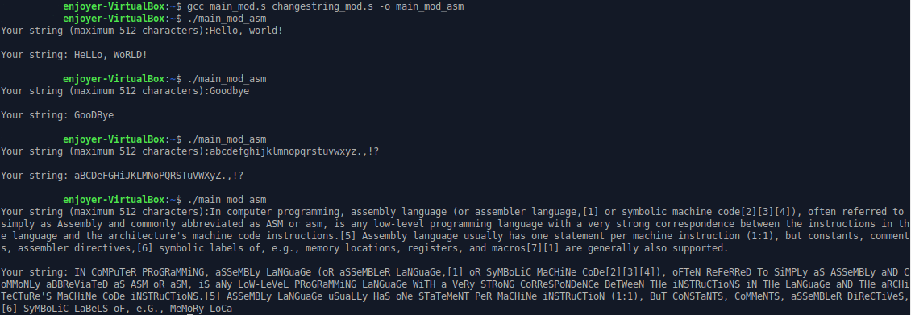

# Тесты:
## Без модификации:
  
## С модификацией:
  
## С использованием регистров:
  

Как видим, результаты всех прогонов абсолютно идентичны, а значит, изменение и оптимизация кода проведены успешно.

(Только в потом заметил, что в одном случае тест на слове Goodbye немного отличается от других, но не думаю, что это имеет какое-то значение, особенно с учётом последнего теста)
