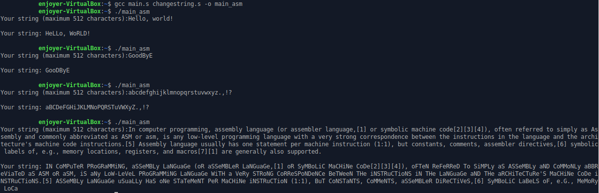

# Тесты:

Следует сказать, что я сравниваю тсключительно ассемблерные программы, и не вижу смысла добавлять в отчёт ещё и тестирование программы на c, поскольку немодифицированная программа на ассемблере является её полным аналогом в данном виде тестов

## Без модификации:
  
## С модификацией:
  
## С использованием регистров:
  

Как видим, результаты всех прогонов абсолютно идентичны, а значит, изменение и оптимизация кода проведены успешно.

(Только в потом заметил, что в одном случаевходные данные при тесте на слове Goodbye немного отличается от других, но вывод корректен при всех случаях, так что не думаю, что это имеет какое-то значение, особенно с учётом последнего теста)
